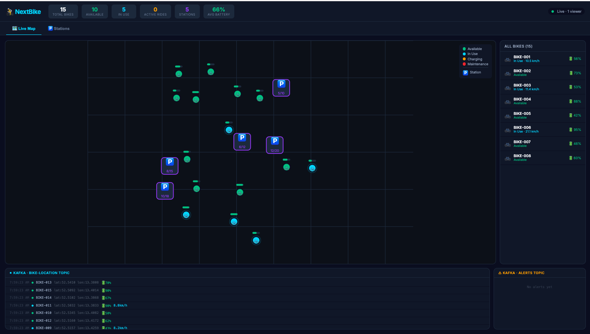
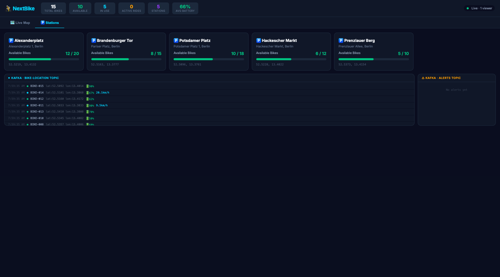
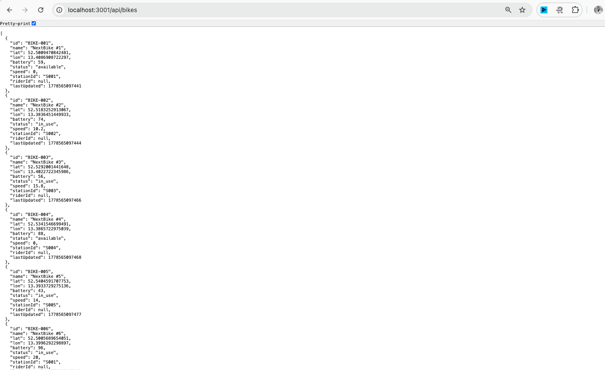
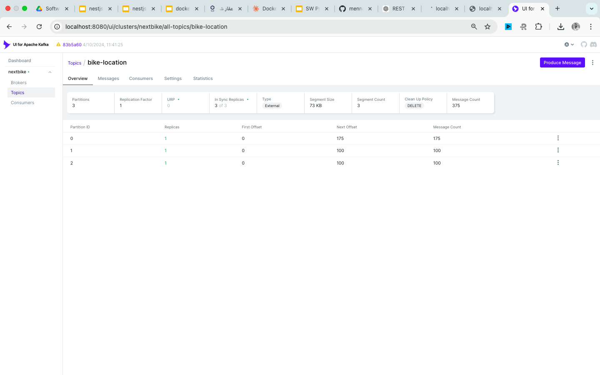

# 🚴 NextBike — Real-Time Bike Sharing Platform

> A full-stack bike-sharing demo built with **NestJS · React · Apache Kafka · Docker**.  
> 15 simulated bikes move around Berlin in real time — GPS events stream through Kafka and the map updates in the browser via WebSocket with zero polling.

---

## 📸 Screenshots

### 🗺 Live Map


### 🚴 Bike Panel


### ⚡ Kafka Feed


### 📊 Kafka UI


> Drop your screenshots into the `screenshots/` folder using the exact filenames above, then push to update the README images.

---

## ✨ Features

| | Feature | Detail |
|---|---|---|
| 🗺 | **Live GPS map** | 15 bikes broadcast position every 3 s; map updates instantly |
| 🚴 | **Ride management** | Start / end rides via REST API |
| ⚡ | **Kafka event bus** | All events flow through dedicated topics |
| 🔌 | **WebSocket push** | socket.io broadcasts updates to every connected browser |
| 📊 | **Fleet stats** | Header shows total / in-use / available / low-battery counts |
| 🛠 | **Kafka UI** | Browse raw messages and consumer lag at `localhost:8080` |

---

## 🏗 Architecture

```
┌─────────────────────────────────────────────────────────────┐
│                      Docker Network                          │
│                                                              │
│  ┌──────────┐     ┌──────────┐     ┌──────────────────┐    │
│  │Zookeeper │────▶│  Kafka   │◀───▶│    Kafka UI      │    │
│  │  :2181   │     │  :9092   │     │     :8080        │    │
│  └──────────┘     └────┬─────┘     └──────────────────┘    │
│                        │                                     │
│               ┌────────▼─────────┐                          │
│               │  NestJS Backend  │  :3001                   │
│               │                  │                          │
│               │  ┌─────────────┐ │  publishes every 3 s    │
│               │  │BikeSimulator│─┼──▶ bike-location         │
│               │  └─────────────┘ │  ▶ ride-events           │
│               │                  │  ▶ alerts                │
│               │  ┌─────────────┐ │                          │
│               │  │BikesService │◀┼── consumes all topics    │
│               │  └─────────────┘ │                          │
│               │  ┌─────────────┐ │                          │
│               │  │  WebSocket  │─┼──▶ socket.io events      │
│               │  │  Gateway    │ │                          │
│               │  └─────────────┘ │                          │
│               └────────┬─────────┘                          │
│                        │  REST + WebSocket                   │
│               ┌────────▼─────────┐                          │
│               │  React Frontend  │  :3000                   │
│               └──────────────────┘                          │
└─────────────────────────────────────────────────────────────┘
```

---

## 📦 Kafka Topics

| Topic | Producer | Consumer | Payload |
|---|---|---|---|
| `bike-location` | BikeSimulator | BikesService | lat, lon, battery, speed |
| `ride-events` | BikesService | BikesService | `RIDE_STARTED` / `RIDE_ENDED` |
| `station-status` | BikesService | BikesService | dock availability |
| `alerts` | BikesService | BikesService | `LOW_BATTERY`, `MAINTENANCE_NEEDED` |

---

## 🚀 Quick Start

### Prerequisites

- **Docker Desktop** with Compose v2
- Free ports: `3000`, `3001`, `8080`, `9092`, `2181`

### 1 — Start everything

```bash
git clone <repo-url>
cd nextbike
make up
# or: docker compose up -d --build
```

> ⏱ First start takes ~2 min — Kafka needs to become healthy before the backend connects.

### 2 — Open in browser

| Service | URL |
|---|---|
| 🌐 Frontend (React) | http://localhost:3000 |
| 🔧 Backend API | http://localhost:3001/api/bikes |
| 📊 Kafka UI | http://localhost:8080 |

---

## 🔌 REST API

```
GET  /api/bikes              → all bikes (position, status, battery)
GET  /api/bikes/:id          → single bike
GET  /api/stations           → all docking stations
GET  /api/stations/:id       → single station
GET  /api/rides/active       → currently active rides
GET  /api/alerts             → recent system alerts
GET  /api/stats              → fleet summary stats

POST /api/rides/start        { bikeId, riderId }  →  start a ride
POST /api/rides/:rideId/end                       →  end a ride
```

### Example responses

```jsonc
// GET /api/stats
{
  "totalBikes": 15,
  "availableBikes": 10,
  "inUseBikes": 5,
  "lowBatteryBikes": 2,
  "activeRides": 5,
  "totalStations": 5
}

// GET /api/bikes/BIKE-001
{
  "id": "BIKE-001",
  "name": "NextBike #1",
  "lat": 52.521,
  "lon": 13.413,
  "battery": 78,
  "status": "available",   // available | in_use | charging | maintenance
  "speed": 0,
  "stationId": "S001",
  "riderId": null,
  "lastUpdated": 1715500000000
}
```

---

## ⚡ WebSocket Events

Connect to `ws://localhost:3001` using socket.io:

```javascript
import { io } from 'socket.io-client';
const socket = io('http://localhost:3001');

socket.on('bike_location',  (bike)  => { /* updated Bike object     */ });
socket.on('ride_event',     (event) => { /* RIDE_STARTED / ENDED    */ });
socket.on('alert',          (alert) => { /* LOW_BATTERY etc.        */ });
socket.on('clients_count',  (n)     => { /* connected browser count */ });
```

---

## 📁 Project Structure

```
nextbike/
├── docker-compose.yml              # Full stack definition
├── Makefile                        # Helper commands
│
├── backend/                        # NestJS application
│   ├── Dockerfile
│   └── src/
│       ├── main.ts                 # HTTP bootstrap + Kafka microservice
│       ├── app.module.ts
│       ├── kafka/
│       │   └── kafka.service.ts    # KafkaJS wrapper — publish / subscribe / topic setup
│       ├── bikes/
│       │   ├── bikes.controller.ts # REST endpoints
│       │   ├── bikes.service.ts    # In-memory state + Kafka event handlers
│       │   └── bikes.types.ts      # Bike, Station, Ride, Alert interfaces
│       ├── gateway/
│       │   └── bikes.gateway.ts    # socket.io server — broadcasts to browsers
│       └── simulator/
│           └── bike-simulator.ts   # @Interval(3000) — moves bikes, publishes GPS
│
└── frontend/                       # React application
    └── src/
        ├── App.tsx                 # Layout, tabs, toast notifications
        ├── hooks/
        │   ├── useApi.ts           # REST fetch + startRide() helper
        │   └── useSocket.ts        # socket.io connection + event dispatch
        └── components/
            ├── StatsBar.tsx        # Fleet numbers across the top
            ├── BikeMap.tsx         # SVG Berlin map with coloured bike markers
            ├── BikePanel.tsx       # Bike list + ride control panel
            └── KafkaFeed.tsx       # Scrolling live event log
```

---

## 🧠 Data Flow

```
BikeSimulatorService  (@Interval every 3 s)
  │  → moves each in_use bike 10–22 km/h in a random direction
  │  → keeps within ~2 km of Berlin centre (52.52°N, 13.41°E)
  │  → drains battery 0.02 % per tick
  │  publishes BikeLocationEvent ──▶ Kafka: bike-location
  │
  ▼
BikesService  (Kafka consumer)
  │  handleLocationEvent() → updates in-memory Bike map
  │  if battery < 15 % → publishes Alert ──▶ Kafka: alerts
  │
  ▼
BikesGateway  (socket.io)
  │  emits 'bike_location' to all connected browsers
  │
  ▼
React — useSocket hook
  └─ updates bike state → BikeMap re-renders marker (no polling)
```

---

## 🗺 Berlin Stations (Seed Data)

| ID | Name | Lat | Lon | Capacity |
|---|---|---|---|---|
| S001 | Alexanderplatz | 52.5219 | 13.4132 | 20 |
| S002 | Brandenburger Tor | 52.5163 | 13.3777 | 15 |
| S003 | Potsdamer Platz | 52.5096 | 13.3761 | 18 |
| S004 | Hackescher Markt | 52.5228 | 13.4022 | 12 |
| S005 | Prenzlauer Berg | 52.5373 | 13.4154 | 10 |

Bikes 1–10 start as `available` at stations. Bikes 11–15 start as `in_use` and are moving immediately.

---

## 🛠 Dev Commands

```bash
make up                    # Build & start full stack (detached)
make down                  # Stop all containers
make logs                  # Tail logs from all services
make logs-backend          # Tail backend only
make logs-frontend         # Tail frontend only
make logs-kafka            # Tail Kafka broker only
make build                 # Rebuild all images without cache
make restart svc=backend   # Hot-restart a single service
make clean                 # Full teardown — removes containers, volumes, images
make status                # Show container health at a glance
```

---

## 📊 Kafka UI

Visit **http://localhost:8080** to:

- Browse messages in each topic in real time
- Monitor consumer group offsets and lag
- Inspect topic partition details
- Check broker health

---

## ⚠️ Known Constraints

| Constraint | Detail |
|---|---|
| **No database** | All state is in-memory — restarting backend resets everything |
| **Single broker** | Not production-HA; fine for local demo |
| **No auth** | REST API is open — anyone can start/end rides |
| **SVG map** | Static overlay, not a real tile map (no Leaflet/Mapbox) |
| **Dev-only volumes** | `./backend/src` is mounted into the container for hot-reload |

